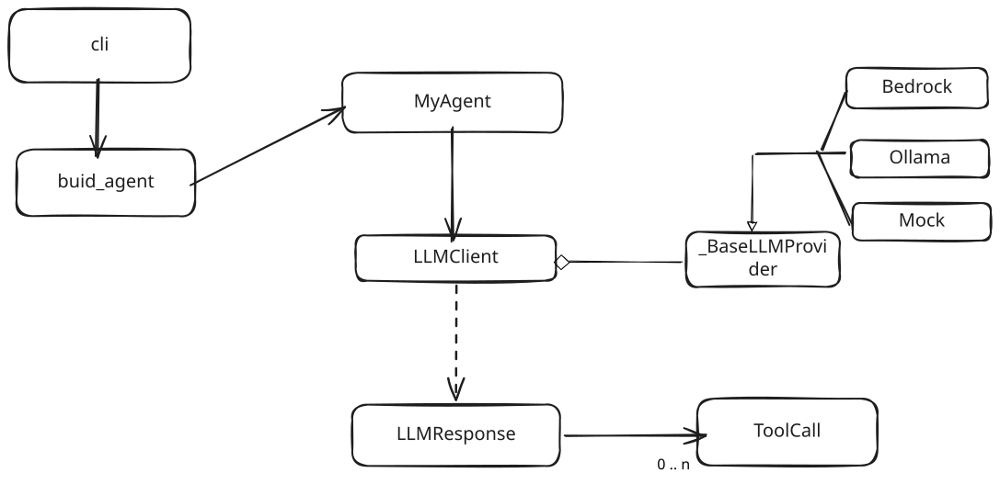

# Informe — Milestone 1

## Diagrama de arquitectura

### 



El `run` itera: LLM decide → si pide `tool_calls`, el agente ejecuta los callables registrados → el resultado se vuelca como mensaje `role: "tool"` → se vuelve a invocar `chat`. Termina cuando el LLM responde solo texto, o al alcanzar `max_iterations`.

## Diseño de la interfaz de herramientas

- **`ToolSchema.from_callable(fn)`**: inspecciona la firma del callable (vía `get_type_hints` + `inspect.signature`) y construye un modelo Pydantic dinámico con `create_model`. De ahí deriva el JSON Schema de parámetros (`model.model_json_schema()`). No escribimos JSON Schema a mano en ningún lado.
- **`Annotated[tipo, Field(description=...)]`**: cada parámetro de la tool se anota así para que el `Field.description` quede embebido en el JSON Schema (`properties.<param>.description`), guiando al LLM sobre qué pasar en cada argumento.
- **Docstring de la función**: se usa tal cual (`inspect.getdoc` + `cleandoc`) como `ToolSchema.description` — es la única fuente de verdad que el LLM ve para entender qué hace la herramienta.
- **`register_tool(tool, schema)`**: guarda dos diccionarios paralelos indexados por `schema.name`: `self._tools[name] = tool` (el callable, para ejecutarlo) y `self._schemas[name] = schema` (el `ToolSchema`, para exponerlo al LLM). Nunca se mezclan: `chat(tools=...)` solo recibe esquemas, jamás callables.
- **`chat(tools=list(self._schemas.values()))`**: en cada llamada del loop se pasa la lista completa de esquemas registrados (o `None` si no hay ninguno). El `LLMClient` fijo es agnóstico de cómo se generaron esos esquemas.
- **Qué hace el `LLMClient` con cada esquema**: internamente llama a `schema.to_llm_spec()` (dict con `name`/`description`/`parameters`) y cada proveedor lo envuelve en su formato nativo — `OllamaProvider._wrap_tool_spec` produce `{"type": "function", "function": {...}}`; `BedrockProvider._wrap_tool_spec` produce `{"toolSpec": {...}}` para la API Converse. El agente nunca ve ese formato nativo, solo trabaja con `ToolSchema`/`LLMResponse` normalizados.

## Cómo termina el bucle

`MyAgent.run` itera hasta `self._max_iterations` (default `10`). En cada vuelta:

1. Llama a `chat(messages, tools, system)`.
2. Si la respuesta **no** tiene `tool_calls` → corta inmediatamente y devuelve `AgentResult(answer=content, steps, input_tokens, output_tokens)`. Esta es la única salida "exitosa" en M1.
3. Si tiene `tool_calls` → agrega el mensaje `role: "assistant"` con esos `tool_calls` al historial, ejecuta cada tool (parseando `arguments` con `json.loads`), agrega un mensaje `role: "tool"` por cada resultado, y vuelve al paso 1.

**Qué pasa al alcanzar el límite**: si se agotan las `max_iterations` sin que el LLM devuelva una respuesta final en texto (p. ej. porque entra en un loop pidiendo tools repetidamente), el `for` termina sin lanzar excepción y la función devuelve `AgentResult(answer="", steps=steps)` — con todos los `AgentStep` acumulados hasta ese punto. Nunca se propaga una excepción ni se devuelve `None`.

`max_history_messages` se acepta en el constructor pero en M1 **no se aplica** (la lista de mensajes crece sin recorte); su uso real para limitar la longitud de la conversación es contrato de M2, junto con la persistencia de estado entre llamadas a `run`.

## Limitaciones conocidas

- **`run` es stateless entre llamadas**: cada invocación arranca el historial desde cero con el `user_message` recibido; no hay memoria entre llamadas sucesivas (eso es M2).
- **`max_history_messages` no se respeta en M1**: una conversación con muchas tool_calls puede generar una lista de mensajes arbitrariamente larga dentro de un mismo `run`.
- **Sin `structured_call`**: el método está como stub (`NotImplementedError`); es contrato de M2.
- **Tool de Markowitz permite posiciones en corto**: la solución de forma cerrada no restringe `w ≥ 0`; una versión long-only requeriría programación cuadrática (scipy, no incluido en las dependencias).
- **`leer_archivo` está acotado al directorio `archivos/`** y rechaza rutas absolutas, pero no valida symlinks que escapen del directorio.
- **Errores de tool desconocida o de ejecución no detienen el loop**: quedan registrados como `AgentStep` con `error` no nulo y el contenido del error se devuelve al LLM como mensaje `tool`, pero si el LLM insiste en la misma tool inválida, el único freno es `max_iterations`.

---

# Tool: Optimizador de Carteras (Markowitz)

## Qué hace

`optimizar_portfolio_markowitz` (en [student_framework/tools/portfolio_markowitz.py](student_framework/tools/portfolio_markowitz.py)) recibe series de retornos históricos por activo y calcula el **portfolio de varianza mínima** según el modelo de Markowitz: los pesos que minimizan el riesgo total de la cartera, sujetos a que sumen 1.

Usa la solución de forma cerrada:

```
w = Σ⁻¹ · 1 / (1ᵀ · Σ⁻¹ · 1)
```

donde `Σ` es la matriz de covarianza muestral de los retornos.

**Limitación conocida:** no restringe los pesos a ser positivos, por lo que permite posiciones en corto (`w` puede tener componentes negativas). La versión long-only requeriría programación cuadrática (no incluida en las dependencias actuales).

## Requisitos previos

```bash
cd /Users/carbonecar/maestria_ia/agentes_autonomos/tp_mia_agentes_2026
source .venv/bin/activate
pip install -r requirements.txt   # incluye numpy>=1.26.0
```

Para ejecutar vía el agente (no para los tests, que usan mocks) hace falta un proveedor LLM activo:

```bash
# Ollama local
export OLLAMA_HOST="http://localhost:11434"
export OLLAMA_MODEL="llama3.1"
ollama serve   # en otra terminal, si no está corriendo
```

## Ejecución directa de la tool (sin LLM)

Útil para validar el cálculo en aislamiento, sin pasar por el agente:

```bash
PYTHONPATH=. python3 -c "
from student_framework.tools.portfolio_markowitz import optimizar_portfolio_markowitz
print(optimizar_portfolio_markowitz({
    'AAPL': [0.02, -0.01, 0.015, 0.005, -0.005, 0.01, 0.0, 0.02],
    'MSFT': [0.015, 0.0, 0.01, 0.008, -0.002, 0.012, 0.005, 0.018],
    'GOOG': [-0.01, 0.02, -0.005, 0.01, 0.0, -0.008, 0.015, 0.005],
}))
"
```

Salida esperada (JSON):

```json
{"pesos": {"AAPL": -0.172198, "MSFT": 0.867702, "GOOG": 0.304496}, "retorno_esperado": 0.007002, "riesgo_portfolio": 0.004181}
```

---

# Informe — Milestone 2

## Estrategia de memoria

El agente pasa a ser **estatal**: `self._history` vive en la instancia y persiste entre llamadas a `run` (no se reinicia por turno). Cada `run` apila el `user_message` recibido y, al final, la respuesta del asistente (y los mensajes `tool` intermedios si hubo tool calls).

Para respetar `max_history_messages` implementamos **ventana deslizante** (`_windowed_messages` en [student_framework/agent.py](student_framework/agent.py)):

- Si el historial completo entra en el presupuesto, se envía tal cual.
- Si no entra, se toman los últimos `max_history_messages` mensajes.
- **Invariante de recencia**: si esa ventana "natural" dejaría afuera al último mensaje de usuario (esto puede pasar dentro de un mismo `run` con muchas idas y vueltas de tool calls), se lo ancla explícitamente y se completa el resto del presupuesto con los mensajes más recientes posteriores a él. El mensaje de usuario más reciente nunca se descarta, aunque eso implique perder más contexto "de cola" del que perdería una ventana estrictamente contigua.
- Para evitar que la ventana arranque con un mensaje `role: tool` huérfano (cuyo `tool_call` quedó fuera de la ventana, lo cual rompería a un proveedor real como Bedrock/Ollama), se recorta cualquier mensaje `tool` líder tras aplicar el corte.

Elegimos sliding window puro (sin resumen ni offload/retrieve) porque:
- Es la estrategia obligatoria del enunciado y cubre el criterio de aprobación ("conversación que supere el presupuesto de contexto y el agente sigue comportándose con sensatez") sin depender de una llamada extra al LLM para resumir (que introduciría costo, latencia y otro punto de falla).
- El tradeoff conocido es pérdida de contexto antiguo: si la conversación gira en torno a algo dicho hace muchos turnos y ya salió de la ventana, el agente lo "olvida". Para este alcance (M2) lo aceptamos explícitamente; una estrategia de *summarization* sería el siguiente paso natural (comprimir los mensajes descartados en un mensaje `system`/`user` sintético) si se necesitara memoria de largo plazo sin perder detalle.

**Problema encontrado**: la tensión entre "nunca superar el cap" y "nunca perder el último mensaje de usuario" no siempre es resoluble con un corte contiguo simple — de ahí la rama de anclaje explícito descripta arriba.

## Salida estructurada

`structured_call(prompt, schema, max_repair_attempts)` mantiene una conversación **aislada** (no comparte `self._history` con `run`, ya que el contrato exige que la *única* tool ofrecida sea `final_result`, y mezclarla con el resto del historial no aporta nada al problema puntual de generar un objeto validado):

1. Arma `tools=[final_result_tool_schema(schema)]` (`ToolSchema` derivado del `BaseModel` vía `tool_schema_from_model`) y lo pasa en **cada** llamada a `chat`.
2. Busca en `response.tool_calls` una invocación a `FINAL_RESULT_TOOL_NAME`.
   - Si no hay ninguna (el modelo respondió con texto libre o invocó otra tool): se agrega un mensaje de reparación explicando que debe usar `final_result` y nada más.
   - Si hay una: se parsea `arguments` como JSON y se valida con `schema.model_validate(...)`.
3. Ante `JSONDecodeError` o `ValidationError`/`TypeError`, se agrega el mensaje `assistant` con el `tool_call` fallido más un mensaje `role: tool` con el motivo exacto del fallo (mismo patrón que usa un proveedor real para tool results), y se reintenta.
4. Se permite `max_repair_attempts` reparaciones además del intento inicial (total: `max_repair_attempts + 1` llamadas a `chat`). Si a la última le sigue fallando, se levanta `StructuredOutputError` (subclase de `RuntimeError`) con el último error registrado — nunca se devuelve `None` ni una instancia parcial.

## Errores en herramientas

**Calculadora** (`simple_calc.py`): valida explícitamente cada operando con `_a_numero` antes de operar (los tipos de la firma no se aplican en runtime — vienen del JSON del `tool_call`, así que si el LLM manda un string no numérico había que interceptarlo a mano). Casos cubiertos:
- Operando no numérico → indica qué parámetro, qué valor recibió y su tipo (ej: *"El parámetro 'operando1' recibió 'cuarenta y dos' (str), que no es un número válido..."*).
- Operador no soportado → lista los 4 operadores válidos.
- División por cero → mensaje específico, no genérico.

Ejemplo de recuperación: el LLM llama `simple_calc(operacion="suma", operando1="cuarenta y dos", operando2=1)`; la tool devuelve el error de arriba como `tool_output`; en el siguiente turno el LLM corrige a `operando1=42` y la tool responde `43.0`.

**Lector de archivos** (`lector_archivos.py`): `_resolver_ruta_segura` centraliza la validación de sandbox (`os.path.commonpath` contra el directorio `archivos/` resuelto en absoluto) antes de tocar el filesystem. Casos cubiertos:
- Ruta vacía, absoluta, con `..`, o que resuelve fuera de `archivos/` → explica la regla violada y da un ejemplo de ruta válida.
- Archivo inexistente → si el directorio contenedor existe, **lista los archivos disponibles** ahí (`os.listdir`) para que el LLM pueda elegir bien.
- Ruta es un directorio → lo indica y lista su contenido.

Ejemplo de recuperación: el LLM pide `leer_archivo(ruta="notas.txt")` que no existe; la tool responde *"El archivo 'notas.txt' no existe. Archivos disponibles en su directorio: archivo.txt."*; el LLM corrige a `ruta="archivo.txt"` en el siguiente turno.

## Resiliencia

`_is_transient_error` clasifica una excepción como transitoria por tipo (`TimeoutError`, `ConnectionError`) o por texto (timeout, 429/5xx, rate limit, throttling, problemas de red). No hay una jerarquía de excepciones común entre Bedrock/Ollama/mocks de test, así que la heurística de texto es deliberada.

- `_chat_with_retry` envuelve cada llamada a `self._llm.chat` (usada tanto en `run` como en `structured_call`): reintenta con backoff lineal hasta `max_llm_retries` (default 3) si el error es transitorio; cualquier otro error se propaga y `run` lo captura para devolver un `AgentResult(error=...)` limpio (nunca lanza).
- `_execute_tool` envuelve cada invocación de tool: reintenta hasta `max_tool_retries` (default 2) si el error es transitorio; el resto (herramienta desconocida, JSON inválido, o las excepciones de validación propias de `simple_calc`/`leer_archivo`) se devuelve tal cual como `AgentStep.error` — son justamente los errores "recuperables por el LLM", no por el agente.

## Tracking de tokens

`_accumulate(total, value)` sirve tanto para `input_tokens` como `output_tokens`: si `value` es `None` no cambia el total (permite que ambos campos empiecen en `None` si ninguna respuesta reportó tokens); en cuanto una respuesta reporta un valor no nulo, se empieza a sumar tratando los `None` subsiguientes como 0. Se acumula por llamada a `run` (no a través de toda la conversación).

## Modos de fallo dentro vs. fuera de alcance

**Dentro de alcance:**
- Historial que excede el presupuesto de contexto (sliding window con recencia garantizada).
- Salida estructurada malformada (texto libre, JSON inválido, schema inválido) → reparación acotada.
- Fallos transitorios de LLM y tools (timeout/5xx/rate limit/red) → retry con backoff.
- Argumentos inválidos en `simple_calc`/`leer_archivo` → error accionable para que el LLM corrija.

**Fuera de alcance (deliberado):**
- Compresión/resumen del contexto descartado (*summarization* u *offload/retrieve*): se documenta como alternativa pero no se implementa: agregaría una llamada extra al LLM (costo/latencia/otro punto de falla) para un problema que sliding window ya resuelve dentro de lo pedido.
- Reintentos infinitos o backoff exponencial con jitter: el backoff es lineal y acotado por `max_llm_retries`/`max_tool_retries`; no hay circuit breaker ni límite de tiempo total.
- Validación de que un `tool_call_id` de reparación coincida exactamente con el formato esperado por cada proveedor real (Bedrock/Ollama) — el formato de mensajes usado en `structured_call`/`run` es el normalizado del framework; la traducción final es responsabilidad del `LLMClient` fijo.
- Símlinks que escapen del sandbox de `leer_archivo` sin pasar por `..` explícito en la ruta (se valida la ruta resuelta contra el directorio base, pero no se resuelven symlinks del propio archivo destino).

## Ejecución vía el agente (CLI)

El agente expone la tool al LLM, que decide cuándo invocarla a partir de un mensaje en lenguaje natural:

```bash
PYTHONPATH=. OLLAMA_HOST=http://localhost:11434 OLLAMA_MODEL=llama3.1 \
python3 -m mia_agents.cli run --module student_framework --message \
"Tengo retornos históricos de tres activos: AAPL=[0.02,-0.01,0.015,0.005,-0.005,0.01,0.0,0.02], MSFT=[0.015,0.0,0.01,0.008,-0.002,0.012,0.005,0.018], GOOG=[-0.01,0.02,-0.005,0.01,0.0,-0.008,0.015,0.005]. ¿Cuáles son los pesos óptimos del portfolio de varianza mínima según Markowitz?"
```

El resultado (`AgentResult`) incluye:

- `answer`: la respuesta del LLM interpretando el resultado de la tool.
- `steps`: un `AgentStep` con `tool_name="optimizar_portfolio_markowitz"`, los `arguments` parseados y el `tool_output` (JSON crudo devuelto por la tool).

## Debug en VS Code

La configuración **"CLI: run agent"** en [.vscode/launch.json](.vscode/launch.json) ya trae `PYTHONPATH`, `OLLAMA_HOST` y `OLLAMA_MODEL` seteados. Para probar la tool de Markowitz desde el debugger, editar el campo `args` de esa configuración y reemplazar el `--message` por una consulta de portfolio como la del ejemplo anterior.

## Tests automáticos

La tool no tiene un test de conformidad dedicado (la suite fija de M1 cubre el contrato general del agente), pero corre dentro de la suite completa sin romper nada:

```bash
python3 -m pytest tests/conformance/test_m1.py
```
