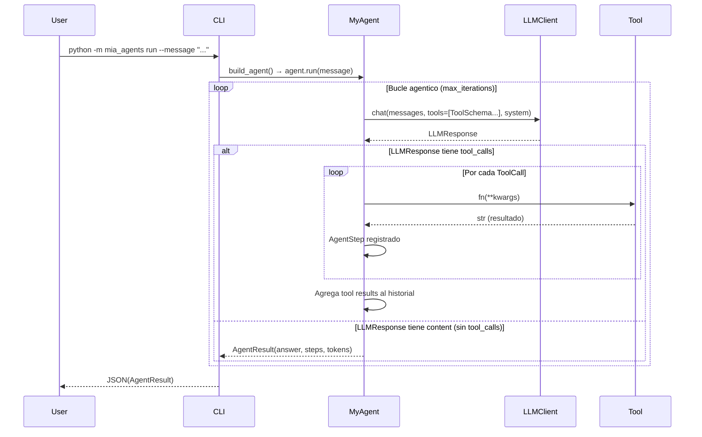
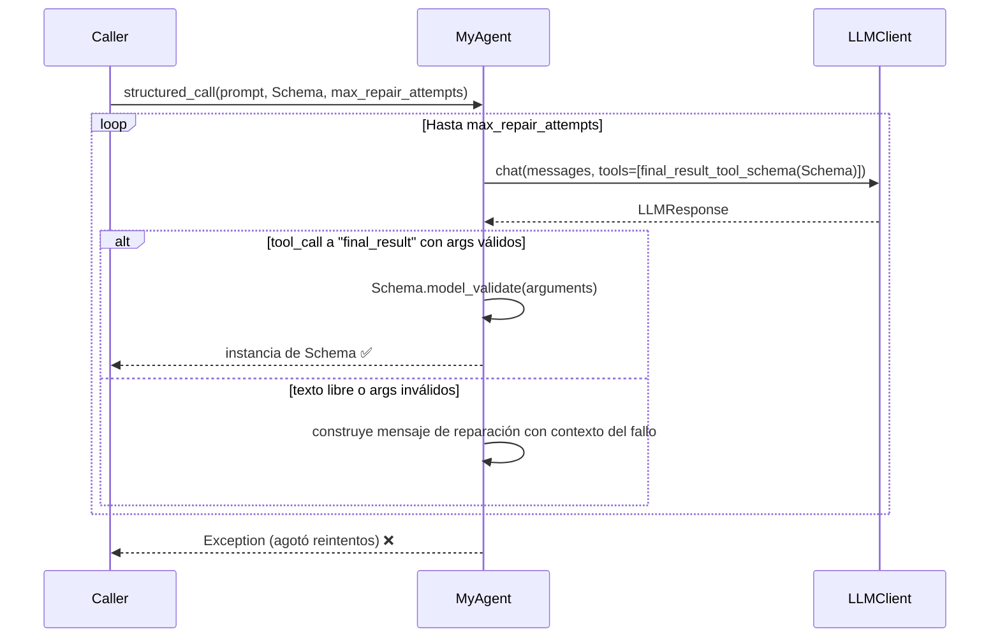

# Arquitectura del proyecto

## Diagrama de clases y módulos

Ver [classes.mmd](classes.mmd).

## Flujo de ejecución (bucle agentico)

## Flujo de structured_call (M2)

## Resumen de la arquitectura

| Capa | Módulo | Responsabilidad |
|---|---|---|
| Framework fijo | `mia_agents/` | Tipos, protocolos, proveedores LLM, CLI, testing |
| Proveedores LLM | `llm_client.py` | Adapta mensajes y tools para Ollama y AWS Bedrock |
| A implementar | `student_framework/` | `MyAgent` con bucle agentico, historial y salida estructurada |
| Tests | `tests/conformance/` | Verifican el contrato `Agent` sin APIs externas (MockLLMClient) |

**Proveedores disponibles:**
- `OllamaProvider` — LLM local vía `OLLAMA_HOST` + `OLLAMA_MODEL`
- `BedrockProvider` — AWS Bedrock vía `BEDROCK_MODEL_ID` + credenciales AWS
- `MockLLMClient` — respuestas prefabricadas para tests deterministas
